# k8slan
k8slan creates a virtual LAN across the k8s cluster, pod attaches to the LAN using [MACVTAP](https://virt.kernelnewbies.org/MacVTap) CNI plugin via [multus](https://k8snetworkplumbingwg.github.io/multus-cni/). 

### Topology

```mermaid
architecture-beta
    service lan(internet)[LAN]
    group worker1[worker1]
        group ns[LAN1_NS] in worker1
            service vxlan1_dev[VxLAN1_dev] in ns
            service br1(logos:aws-eventbridge)[BR1] in ns
            service vxlan1(logos:nanonets)[VxLAN1] in ns
            service veth_B1(logos:nanonets)[Veth1 Br] in ns
            vxlan1_dev:T --> B:vxlan1
        service veth1(logos:nanonets)[Veth1] in worker1
        group pod1[pod1] in worker1
        service macvtap1(logos:nanonets)[macvtap1] in pod1
        br1:L -- R:vxlan1
        br1:B -- T:veth_B1
        veth1:L -- R:veth_B1
        veth1:T -- B:macvtap1
    
    group worker2[worker2]
        group ns2[LAN1_NS] in worker2
            service vxlan2(logos:nanonets)[VxLAN2] in ns2
            service br2(logos:aws-eventbridge)[BR2] in ns2
            service veth2_B(logos:nanonets)[Veth2 Br] in ns2
            service veth3_B(logos:nanonets)[Veth3 Br] in ns2
            service vxlan2_dev[VxLAN2_dev] in ns2
            vxlan2_dev:T --> B:vxlan2
        service veth2(logos:nanonets)[Veth2] in worker2
        group pod2[pod2] in worker2
            service macvtap2(logos:nanonets)[macvtap2] in pod2
        br2:R -- L:vxlan2
        br2:B -- T:veth2_B
        veth2:R -- L:veth2_B
        veth2:T -- B:macvtap2
        group pod3[pod3] in worker2
            service macvtap3(logos:nanonets)[macvtap3] in pod3
        service veth3(logos:nanonets)[Veth3] in worker2
        br2:T -- B:veth3_B
        veth3:R -- L:veth3_B
        veth3:T -- B:macvtap3    
    vxlan1:L -- R:lan
    lan:L -- R:vxlan2

```

For a given virtual LAN, following are created on each participating worker:
- a dedicate network namespace for LAN, which contains:
    - a bridge interface
    - a vxlan interface use multicast address that connects all nodes together and also attach to the bridge interface
    - a vxlan underlying interface
    - a list of spoke veth interfaces attache to the bridge, one for each local pod attaching to the LAN
- a list of veth interfaces in host NS, which are the corresponding peers of veth interfaces in the LAN NS
- a list of macvtap interfaces on one of each veth interface pair

## Installation 
### Prerequisites
Before installation, following are required:

- IPv6 is enabled on each worker 
- an interface used as vxlan underlying 
- multus installed
- 

## 