# k8slan
k8slan creates virtual LANs across the k8s cluster, main use case is to have one or multiple virutal layer2 networks that connects CNFs/VNFs;

*note: It is optimized for easy of use and compatiable with CNF/VNF, not for performance*

### Topology

```mermaid
architecture-beta
    service lan(internet)[LAN]
    group worker1[worker1]
      service vxlan1_dev[VxLAN1_dev] in worker1
        group ns[LAN1_NS] in worker1
            service br1(logos:aws-eventbridge)[BR1] in ns
            service vxlan1(logos:nanonets)[VxLAN1] in ns
            service veth_B1(logos:nanonets)[Veth1 Br] in ns
            vxlan1_dev:B --> T:vxlan1

        group pod1[pod1] in worker1
        service veth1(logos:nanonets)[Veth1] in pod1
        br1:L -- R:vxlan1
        br1:B -- T:veth_B1
        veth1:L -- R:veth_B1
        
    
    group worker2[worker2]
        service vxlan2_dev[VxLAN2_dev] in worker2
        group ns2[LAN1_NS] in worker2
            service vxlan2(logos:nanonets)[VxLAN2] in ns2
            service br2(logos:aws-eventbridge)[BR2] in ns2
            service veth2_B(logos:nanonets)[Veth2 Br] in ns2
            service veth3_B(logos:nanonets)[Veth3 Br] in ns2            
            vxlan2_dev:B --> T:vxlan2
        
        group pod2[pod2] in worker2
            service veth2(logos:nanonets)[Veth2] in pod2
        br2:R -- L:vxlan2
        br2:B -- T:veth2_B
        veth2:R -- L:veth2_B

        group pod3[Kubevirt VM pod3] in worker2
            service macvtap3(logos:nanonets)[macvtap3] in pod3
        service veth3(logos:nanonets)[Veth3] in worker2
        br2:T -- B:veth3_B
        veth3:R -- L:veth3_B
        veth3:T -- B:macvtap3    
    vxlan1:L -- R:lan
    lan:L -- R:vxlan2

```


For a given virtual LAN, following are created on each participating worker:
- a dedicate network namespace for the LAN, which contains:
    - a bridge interface
    - a vxlan interface use multicast address that connects all nodes together and also attach to the bridge interface
        - the vxlan underlying device lives in the host namespace, so it is shared across LANs
    - a list of spoke veth interfaces attache to the bridge, one for each local pod attaching to the LAN
- for a Kubevirt VM pod attached to the LAN
  - a veth interfaces in host NS, which is the corresponding peers of veth interfaces in the LAN NS
  - a macvtap interfaces inside kubevirt VM pod, which is on top of the veth interface in host NS
- for a other type of pod attached to the LAN
  - a veth interfaces in pod NS, which is the corresponding peers of veth interfaces in the LAN NS

## Installation 
### Prerequisites
Before installation, following are required:

- IPv6 is enabled on each worker 
- an interface used as vxlan underlying, this interface must be able to forward IPv6 multicast traffic to other workers; one simple option is a L2 network shared by all workers.
- cert-manager
- multus installed


### installation
`kubectl apply -f xxxx.yaml`

### installed components
- a macvtap CNI plugin on each host
- a k8s namespace: k8slan-system, in the namespace:
    - a deployment: k8slan-controller-manager 
    - a daemonset: k8slan-ds (require privilage)


## Usage
1. For each virtual LAN, create a LAN CR
```
apiVersion: lan.k8slan.io/v1beta1
kind: LAN
metadata:
    name: lan-test
    namespace: k8slan-system
spec:
  ns: knlvrf
  bridge: br2
  vxlan: vx2
  vni: 222
  defaultVxlanDev: eth0.10
  vxlanDevMap:
    worker1: eth1
    worker2: eth2
  spokes:
  - pod1
  - pod2
```
- `vxlanDevMap` list which interface to use as vxlan interface underlying device on the specified host, key is the hostname, value is the interface name; if a host is not listed here, then `defaultVxlanDev` is used
- `spokes` is a list of veth interface names, one for each connecting pod; in case of kubevirt VM, a macvtap interface is created on top of the veth interface.
- following values must be unique across all LAN CRs
    - ns
    - spoke
    - vni

    **Note: having duplicate value for above field could cause networking issue and/or connecting pod failed to create**

2. k8slan will create two NetworkAttachmentDefinition for each spoke in the CR:
  - one is `k8slan-mac-<spoke>`
  - one is `k8slan-veth-<spoke>`

3. create the pod attach to the LAN:
- reference the NetworkAttachmentDefinition with prefix `k8slan-veth-`
- reference spoke name in resource section: `macvtap.k8slan.io/k8slan-veth-pod2: 1`
```
apiVersion: v1
kind: Pod
metadata:
  name: nginx
  annotations:
    k8s.v1.cni.cncf.io/networks: vlan44
spec:
  containers:
  - name: nginx
    image: nginx:1.14.2
    ports:
    - containerPort: 80
    resources:
      limits:
        macvtap.k8slan.io/pod2: 1
```

3a. Or create a kubevirt VM connect to the LAN
- refer to [kubevirt macvtap guide](https://kubevirt.io/user-guide/network/net_binding_plugins/macvtap/).
- reference to the NetworkAttachmentDefinition with prefix `k8slan-mac-` in the `networks` section
```
apiVersion: kubevirt.io/v1
kind: VirtualMachine
metadata:
  labels:
    kubevirt.io/vm: vm-net-binding-macvtap
  name: testvm-1
spec:
  runStrategy: Always
  template:
    metadata:
      labels:
        kubevirt.io/vm: testvm-1
    spec:
      domain:
        devices:
          disks:
          - disk:
              bus: virtio
            name: containerdisk
          - disk:
              bus: virtio
            name: cloudinitdisk
          interfaces:
          - name: podnet
            masquerade: {}
            ports:
              - name: ssh
                port: 22
          - name: hostnetwork
            binding:
              name: macvtap
          rng: {}
        resources:
          requests:
            memory: 1024M
      networks:
      - name: podnet
        pod: {}
      - name: hostnetwork
        multus:
          networkName: k8slan-mac-pod1
      terminationGracePeriodSeconds: 0
      volumes:
      - containerDisk:
          image: localhost/mytool:v1
        name: containerdisk
      - cloudInitNoCloud:
          userData: |
            #cloud-config
            ssh_pwauth: True
            users:
              - name: test
                shell: /bin/bash
                plain_text_passwd: test123
                lock_passwd: false
                sudo: ALL=(ALL) NOPASSWD:ALL
          networkData: |
            version: 2
            ethernets:
              enp1s0:
                dhcp4: true
        name: cloudinitdisk
```