# Design of k8slan
The design requiurements of k8slan are following:
1. Using a CR to create a virtual LAN across k8s cluster
2. Support CNF and VNF (kubevirt VM) attach to the LAN, which could send traffic with any source MAC

## Design Choices
- Use MACVTAP with passthorugh mode to meet requirement #2
- use a bridge for local pod attachements, vxlan to inter-host connections
- due to requirement of passthru mode, can not use MACVTAP on top of the bridge since there is only one passthru MACVTAP per uderlying interface; for each attachement, use a pair of veth interface, one end connect to the bridge, another end for MACVTAP;
    - MACVTAP over bridge VLAN interface also won't work
- can't use kubevirt MACVTAP device plugin since it only supports pre-existing interface, while in this case, the bridge/veth interfaces won't be created until the first pod using the LAN is created, so a different device plugin is needed, which advertise veth interface resource without actually creating it yet (as soon as LAN CR is created)
- the bridge,vxlan,and veth bridge end are inside a LAN specific namespace, this is to avoid k8s normal CNI iptable/NAT rule interference in the host NS; only the vxlan underly device and veth macvtap end lives in the host NS
- vxlan use IPv6 multicast group address so that there is no need to provision address on vxlan underlying interface

## implementation
k8slan contains following components:
1. LAN CR
1. LAN CR operator, and webhook for defaulting and validating LAN CR
1. a LAN CR daemonset (LAN DS)
1. a MACVTAP device plugin
1. stock kubevirt MACVTAP CNI plugin 

notes: 
 - the LAN DS and device plugin are a signle executive
 

creation work flow is following:
1. user provioned a LAN CR, and net-attch-def for all spokes in the CR
2. the webhook default/validate the CR
3. the operator creates a net-attach-def for each spoke in the CR
4. the LAN DS adds host specific finalizer and send the CR to device plugin via golang channel
5. device plugin advertise the spoke to k8s, so that every worker has the spoke resrouce available 
6. k8s schedule the pod to one of workers (since every worker will advetise the spoke resource)
7. kubelet on the k8s chosen worker invoke device plugin's `Allocate` method, which will creates the namespce, bridge, vxlan, veth and macvtap interfaces
8. pod is created, kubelet then invoke MACVTAP CNI plugin to use the macvtap interface created in #7

remove work flow is following:

- when pod is removed, no interface on the host is removed, since everytime pod is created, the veth and macvtap interface is always recreated even if they already exists

- when CR is removed:
    1. the the LAN DS send LAN CR to device plugin via another golang channel
    2. the device plugin removes the namespace, which implictly removes all created interfaces
    3. all corresponding net-attach-def are also removed (due to fact their owner is the LAN)

## example topo

```mermaid
architecture-beta
    service lan(internet)[LAN]
    group worker1[worker1]
        group ns[LAN1_NS] in worker1
            service vxlan1_dev[VxLAN1_dev] in ns
            service br1(logos:aws-eventbridge)[BR1] in ns
            service vxlan1(logos:nanonets)[VxLAN1] in ns
            service veth_B1(logos:nanonets)[Veth1 Br] in ns
            vxlan1_dev:T --> B:vxlan1
        service veth1(logos:nanonets)[Veth1] in worker1
        group pod1[pod1] in worker1
        service macvtap1(logos:nanonets)[macvtap1] in pod1
        br1:L -- R:vxlan1
        br1:B -- T:veth_B1
        veth1:L -- R:veth_B1
        veth1:T -- B:macvtap1
    
    group worker2[worker2]
        group ns2[LAN1_NS] in worker2
            service vxlan2(logos:nanonets)[VxLAN2] in ns2
            service br2(logos:aws-eventbridge)[BR2] in ns2
            service veth2_B(logos:nanonets)[Veth2 Br] in ns2
            service veth3_B(logos:nanonets)[Veth3 Br] in ns2
            service vxlan2_dev[VxLAN2_dev] in ns2
            vxlan2_dev:T --> B:vxlan2
        service veth2(logos:nanonets)[Veth2] in worker2
        group pod2[pod2] in worker2
            service macvtap2(logos:nanonets)[macvtap2] in pod2
        br2:R -- L:vxlan2
        br2:B -- T:veth2_B
        veth2:R -- L:veth2_B
        veth2:T -- B:macvtap2
        group pod3[pod3] in worker2
            service macvtap3(logos:nanonets)[macvtap3] in pod3
        service veth3(logos:nanonets)[Veth3] in worker2
        br2:T -- B:veth3_B
        veth3:R -- L:veth3_B
        veth3:T -- B:macvtap3    
    vxlan1:L -- R:lan
    lan:L -- R:vxlan2

```

